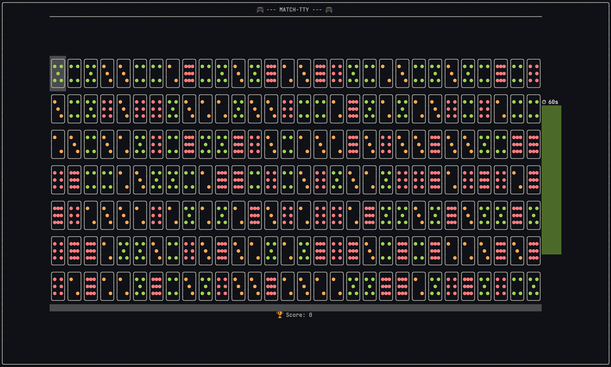

# match-tty

A **Match-3 puzzle game** that runs entirely in your terminal, built with modern C++20 and [FTXUI](https://github.com/ArthurSonzogni/FTXUI).

Swap adjacent pin tiles to match rows or columns of 3+ identical tiles, earn points, and beat the clock.



## Why a terminal based match game ?

Because you can fire up one anywhere in the terminal. And it's an era of TUIs!

Boring waiting for your agent to work on something? Create a tmux pane, fire up a game and get the work done while you are playing!

## Features

### Game Features

- **6 tile types** rendered as Mahjong-like dot patterns.
- **Smooth animations**: swap, eliminate, fall-down (gravity), and flash effects.
- **Chain reactions**: matches trigger cascading eliminations.
- **Scoring** with level progression.

### Technical Features

- **Portable**: Barely any binary dependency once built, which means it's largely portable where ever you've got a terminal to work on.
- **Minimal Size**: Binary is < 1 MB. Enough to squeeze into some embedded systems. Numbers on MacOS 26: 900+ KB before strip. 600+ KB after strip.

## Usage

```bash
<build-dir>/src/match-tty --rows 7 --cols 19 --dur 60
```

Use **arrow keys** to navigate, **Space** to select, and **arrow keys** to swap with adjacent pins.

| Option | Description |
|---|---|
| `--rows`, `--cols` | Grid dimensions |
| `-d`, `--dur` | Game time in seconds (default: 60) |
| `--time-gain` | Time bonus per eliminated pin |
| `--penalty` | Penalty seconds for rapid swaps |
| `--log <file>` | Enable file logging |
| `-f`, `--frame-dur-ms` | Animation frame rate (dev) |

## Build

```bash
cmake -S ./ -B build/ && cmake --build ./build/ --parallel 8
```

All dependencies (FTXUI, fmt, Quill, Lyra, Catch2) are fetched automatically via CMake `FetchContent`.

To **strip** the binary for a smaller release build:

```bash
cmake -S ./ -B build/ -DCMAKE_BUILD_TYPE=Release
cmake --build ./build/ --parallel 8
```

You can proceed to strip the binary for smaller size:
```bash
strip ./build/src/match-tty
```
